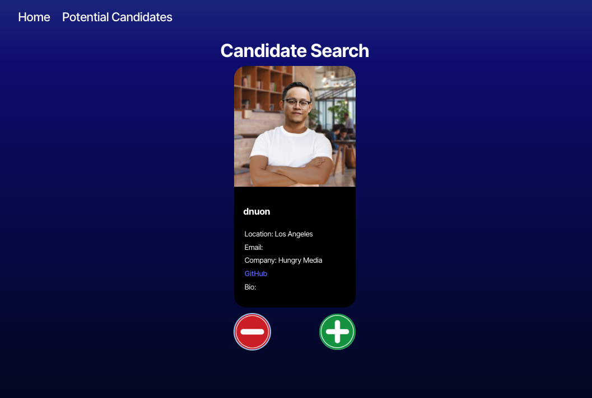

# Recruiter-Search_App

## Description
Think of this app as Tinder for prospective engineering candidates where you can scroll and click for users on GitHub. You may access it here:

## Usage
Screenshot:  
  

You can access the app at the link shared above or use the code base on your local machine!

## Technical Features
This app uses TypesScript, React.js and the GitHub API to pull users for review as potential engineering candidates. API information: https://docs.github.com/en/rest?apiVersion=2022-11-28

A random user is first found, then this information is passed down to a child component using a second, different API call to return that user's information. This information is passed back up to the parent component which can then be added to local storage using the + button. The information in local storage is passed to the Potential Candidates page for review. From there, the reject button allows users to remove candidates from local storage, one by one. 

## Credits & How to Contribute
This was created by Johann Zaroli. Please contact me on GitHub at Jzaroli with any questions or requests.

## License
MIT License

Copyright (c) <2024>

Permission is hereby granted, free of charge, to any person obtaining a copy of this software and associated documentation files (the "Software"), to deal in the Software without restriction, including without limitation the rights to use, copy, modify, merge, publish, distribute, sublicense, and/or sell copies of the Software, and to permit persons to whom the Software is furnished to do so, subject to the following conditions:

The above copyright notice and this permission notice shall be included in all copies or substantial portions of the Software.

THE SOFTWARE IS PROVIDED "AS IS", WITHOUT WARRANTY OF ANY KIND, EXPRESS OR IMPLIED, INCLUDING BUT NOT LIMITED TO THE WARRANTIES OF MERCHANTABILITY, FITNESS FOR A PARTICULAR PURPOSE AND NONINFRINGEMENT. IN NO EVENT SHALL THE AUTHORS OR COPYRIGHT HOLDERS BE LIABLE FOR ANY CLAIM, DAMAGES OR OTHER LIABILITY, WHETHER IN AN ACTION OF CONTRACT, TORT OR OTHERWISE, ARISING FROM, OUT OF OR IN CONNECTION WITH THE SOFTWARE OR THE USE OR OTHER DEALINGS IN THE SOFTWARE.
